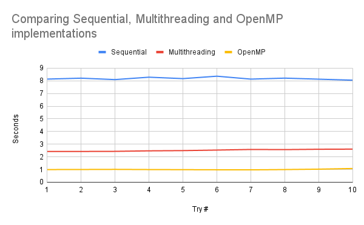
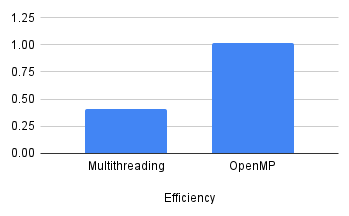

  
Lebanese American University - School of Arts & Sciences  
CSC447 - Parallel Programming for Multicore and Cluster Systems  
Instructor: Dr. Hamdan Abdellatef  
Jalal El Zein - 202105966  
Due : 31 / 04 / 2023

# Table of Contents
- [Table of Contents](#table-of-contents)
- [I - Introduction](#i---introduction)
  - [1. What is a Martix?](#1-what-is-a-martix)
  - [2. What is Martix Multiplication?](#2-what-is-martix-multiplication)
    - [a. When Can We Multiply Matrices?](#a-when-can-we-multiply-matrices)
    - [b. Product of Matrix Multiplication](#b-product-of-matrix-multiplication)
  - [3. Why Parallelize Martix Multiplication](#3-why-parallelize-martix-multiplication)
- [II - Parallelization](#ii---parallelization)
  - [1. Sequential Implementation](#1-sequential-implementation)
  - [2. General Parallelization Strategy](#2-general-parallelization-strategy)
  - [3. Parallelization using Multithreading](#3-parallelization-using-multithreading)
  - [4. Parallelization with OpenMP](#4-parallelization-with-openmp)
- [III - Code](#iii---code)
- [IV - Performance Evaluation](#iv---performance-evaluation)
  - [0. Environment \& Testing](#0-environment--testing)
    - [a. Environment](#a-environment)
    - [b. Test Cases](#b-test-cases)
    - [c. Recording Results](#c-recording-results)
  - [1. Sequential Implementation](#1-sequential-implementation-1)
  - [2. OpenMP Implementation](#2-openmp-implementation)
    - [a. Speedup Factor](#a-speedup-factor)
    - [b. Efficiency](#b-efficiency)
    - [c. Scalability](#c-scalability)
  - [3. Multithreading Implementation](#3-multithreading-implementation)
    - [a. Speedup Factor](#a-speedup-factor-1)
    - [b. Efficiency](#b-efficiency-1)
    - [c. Scalability](#c-scalability-1)
- [V - Method Comparison](#v---method-comparison)
  - [Raw Speed \& Speedup Factor](#raw-speed--speedup-factor)
  - [Efficiency](#efficiency)
  - [Scalability](#scalability)
  - [Consistency](#consistency)
- [VI - Discussion \& Conclusion](#vi---discussion--conclusion)


# I - Introduction

## 1. What is a Martix?
Matrices are two-dimensional arrays of numbers, usually organized in *rows* and *columns*.  

They are very important and have applications in Computer Graphics, Image Processing, Machine Learning, Physics et cetera.

Example:
$$X = \begin{bmatrix}1 & 2 & 3\\
3 & 4 & 5\\
6 & 7 & 8
\end{bmatrix}$$

## 2. What is Martix Multiplication?
Multiplication is one of the most important operations to be performed on a matrix.  

### a. When Can We Multiply Matrices?
Matrix Multipication is only possible when the number of rows $r$ of the first matrix is equal to the number of columns $c$ in the other matrix.

### b. Product of Matrix Multiplication
Let $A$ be an $n × k$ matrix, and $B$ be an $k × m$ matrix.  
The product $A × B$ is an $n × m$ matrix, such that:  
The $(i, j)^{th}$  entry of $A×B$ is $[c ij]$ where $c_{ij} = (a_{i1}×b_{1j}) + (a_{i2}×b_{2j}) + …$

## 3. Why Parallelize Martix Multiplication
We observe that matrix multiplication is often used in computationally intensive tasks, that also often deal with massive data.  

Additionally, the best sequential implementation of Matrix Multiplication runs in $O(n^3)$ asymptotic time complexity, which scales horribly with large data.

Thus, we need to take advantage of parallel techniques to reduce the time needed to perform these operations.

# II - Parallelization

## 1. Sequential Implementation
The sequential implementation of matrix multiplication will be used as a benchmark for the evaluation of the parallel implementations discussed later.

The sequential implementation used here will be the standard implementation in $O(n^3)$ asymptotic time complexity.

Here is the general pseudo-code followed:
```
for every row in C do
    for every column in C do
        for every row in A do
            entry C += entry A * entry B
```
## 2. General Parallelization Strategy
To parallelize this computation, I plan to distribute the rows among "nodes", whether that be threads accessing shared memory, or threads communicating by passing messages.


## 3. Parallelization using Multithreading
For multithreading, I will be distrubuting the rows of the result matrix statically and evenly based on the total number of rows and number of available threads.

This will be done by creating the different threads with numbered IDs which I can use later to assign a section of the resulting matrix.

## 4. Parallelization with OpenMP
The OpenMP implementation here follows the same strategy of distributing the rows among threads though it is executed more loosely.

I used the `#pragma` to parallelize the outermost for loop among some threads that will be decided by the OpenMP runtime library at runtime based on the number of available processors or cores on the system.  
The default behavior of the library, as implemented, ses as many threads as there are available processors or cores on the system.

# III - Code
The code was written in C++ adhering to C++20 standards.  
The standard implementations of the  OpenMP library (`omp.h`) and Threads (`std::thread`) were used.  
Time measurement was implemented with the `chrono` library for C++ for the highest precision results.

The outputs of the programs are written to textfiles that would be created in the same directory of the source files.

Instructions/Commands for compiling each program is included as a comment in the last 2 lines of every source file.

You can find the code on [Github](https://github.com/jalal-elzein/Matrix-Multiplication-Parallelization/)

# IV - Performance Evaluation

## 0. Environment & Testing

### a. Environment
All implementations were tested on single machine, with the same performance settings and same power settings to avoid external bias.

Machine Specifications:  
Component | Name / Model / Details
--- | ---
Operating System | Windows 11 Pro (22H2)
System Type | x64
Processor | 11th Gen Intel Core i5-1135G7 @ 2.40GHz
RAM | 8.00GB DDR4 @ 3200MHz
GPU | Intel Iris Xe Graphics
Dedicated GPU | NVIDIA GeForce MX350


### b. Test Cases
Both Parallel Implementations ran with the same number of  threads.  
All implementations were tested using 2 sample matrices of size $1000 × 1000$.  
All implementations were tested the same matrices initialized as follows:

```cpp
for (int i = 0; i < a; i++)
{
    for (int j = 0; j < b; j++)
    {
        m1[i][j] = i + j;
    }
}

for (int i = 0; i < b; i++)
{
    for (int j = 0; j < c; j++)
    {
        m2[i][j] = i - j;
    }
}
```
where $m_1$ is an $a × b$ matrix, and $m_2$ is an $b × c$ matrix.

### c. Recording Results
Each implementation was ran 10 times, recording the time elapsed between starting the computation and ending it. Meaning operations like initializing the matrices, including libraries, taking input, printing output et cetera, were excluded from the recorded time.  
However, initializing threads is a cost of parallelization, so this operation was included.

## 1. Sequential Implementation
Run # | Time (microseconds)
--- | ---
1 | 8132533
2 | 8205830
3 | 8094021
4 | 8283010
5 | 8170052
6 | 8361042
7 | 8131340
8 | 8208902
9 | 8127125
10 | 8046639
 | 
Average | 8176049.4

> 8.1760494 seconds on average

## 2. OpenMP Implementation
Run # | Time (microseconds)
--- | ---
1 | 997517
2 | 1002974
3 | 1011741
4 | 998237
5 | 990064
6 | 980729
7 | 975253
8 | 998024
9 | 1029758
10 | 1081221
 | 
Average | 1006551.8

> 1.0065518 second on average

### a. Speedup Factor
> Speedup Factor $S(p) = \frac{t_s}{t_p}$  
> In this case, $t_s=8.1760494$, and $t_p=1.0065518$  
> So, 
> $S(p)=8.122830$

### b. Efficiency
> Efficiency $E = \frac{t_s}{t_p × p} = \frac{S(p)}{p} × 100$  
> In this case, $S(p)=8.122830$ and $p = 8$  
> So $E = 1.015354$  

### c. Scalability
> Detailed information about runs and how graphs were made can be found in this [spreadsheet](https://docs.google.com/spreadsheets/d/1uapGegDi8LtIh6D2wkXR_9pO6y5jBO1hFwivQwpMMiY/edit?usp=sharing)  

%20vs.%20Number%20of%20Threads.png)


We can notice the speed up factor generally increases as the number of threads increases. However, we notice this increase plateau around 8 threads.

## 3. Multithreading Implementation
Run # | Time (microseconds)
--- | ---
1 | 2422249
2 | 2425972
3 | 2434168
4 | 2474027
5 | 2493085
6 | 2534890
7 | 2583405
8 | 2571563
9 | 2599692
10 | 2609645
 | 
Average | 2514869.6

>2.5148696 seconds on average

### a. Speedup Factor
> Speedup Factor $S(p) = \frac{t_s}{t_p}$  
> In this case, $t_s=8.1760494$, and $t_p=2.5148696$  
> So, 
> $S(p)=3.251083$

### b. Efficiency
> Efficiency $E = \frac{t_s}{t_p × p} = \frac{S(p)}{p} × 100$  
> In this case, $S(p)=3.251083$ and $p = 8$  
> So $E = 0.406385$  

### c. Scalability
> Detailed information about runs and how graphs were made can be found in this [spreadsheet](https://docs.google.com/spreadsheets/d/1uapGegDi8LtIh6D2wkXR_9pO6y5jBO1hFwivQwpMMiY/edit?usp=sharing)  

%20vs.%20Number%20of%20Threads.png)
%20vs.%20Number%20of%20Threads.png)  

We notice graphically, that speedup increases as the number of threads increases. However, this increase starts to plateau around 6 threads, though it does not become stable until around 8 threads.

# V - Method Comparison

  
In addition to our calculated metrics, by plotting the elapsed time taken by each implementation to complete multiplying the matrices, we can  gain a lot of insight on each algorithm.

## Raw Speed & Speedup Factor
It is clear that the OpenMP is the fastest implementation out of the 3 present.  
In fact OpenMP is almost $8$ times faster than the sequential algorithm, and $2.5$ times faster than manual multithreading!

## Efficiency
We have already calculated the efficiency of the OpenMP implementation and the Multithreading implementation, and it is clear that OpenMP is more efficient.

OpenMP has an efficiency of $E = 1.015354$ while Multithreading has an efficiency of $E = 0.406385$



We can see that OpenMP is $2.4985 \approx 2.5$ times more efficient than manual multithreading.

## Scalability
We observed in section IV when measuring scalability, that both parallel implementations scale similarly with the number of threads, as both of them stabalize at 8 threads

## Consistency
We notice that the sequential algorithm has the highest variance in its values, which means it's the least consistent algorithm out of the 3.  

On the other hand, OpenMP yeilds the least variance, making it the most consistent implementation.

# VI - Discussion & Conclusion
It is clear OpenMP is a better solution to implement a parallelized algorithm for matrix multiplication due to its superior efficiency and speedup.  
Moreover, it's simpler to use and is more beginner friendly, which contributes to abstracting away many details that further optimize some algorithms under the hood, to no knowledge of the programmer perhaps!

It is important to note that the reason why OpenMP surpasses multithreading is not explored in this report but could be one of the following reasons:
1. Load balancing: OpenMP can dynamically adjust the workload across threads to balance the processing load, which can lead to better performance. Multithreading typically requires you to manually divide the work among threads, which can be less efficient if the workload is not evenly distributed.

2. Cache coherence: OpenMP can better utilize cache coherence, which can improve performance on multi-core processors. Cache coherence refers to the synchronization of cache data between multiple cores, and OpenMP provides mechanisms to ensure that data is correctly shared between threads, which can reduce cache misses and improve performance.

3. Optimizations: OpenMP compilers can perform more advanced optimizations than multithreading, such as loop unrolling and vectorization. These optimizations can further improve performance and efficiency.
